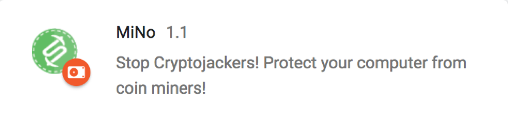
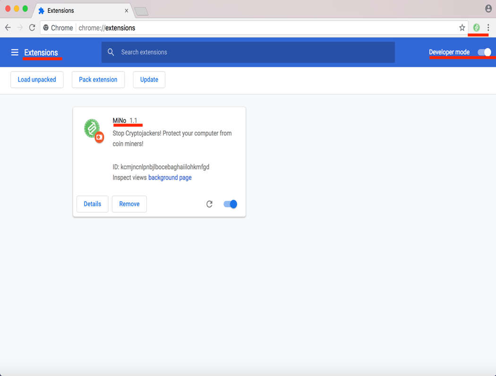
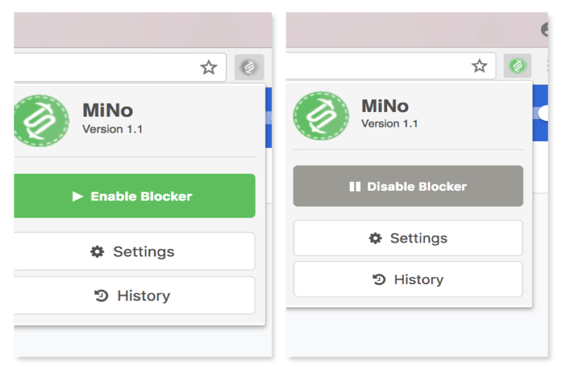
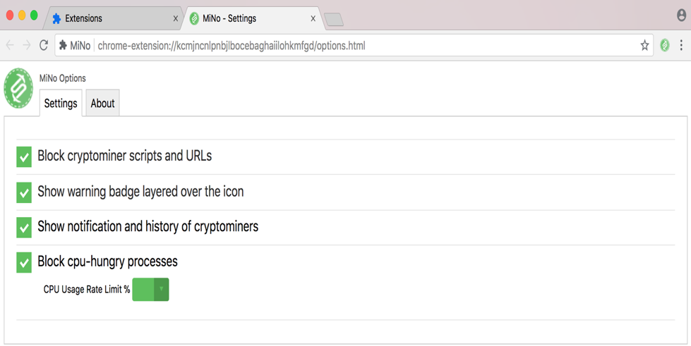
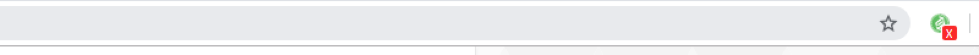
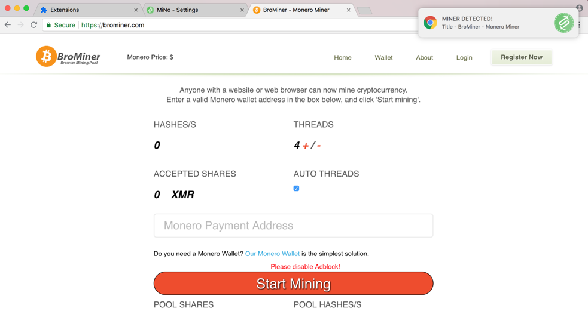
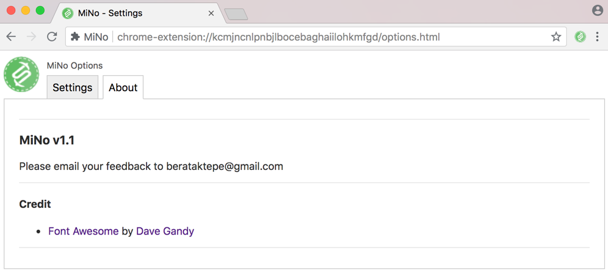
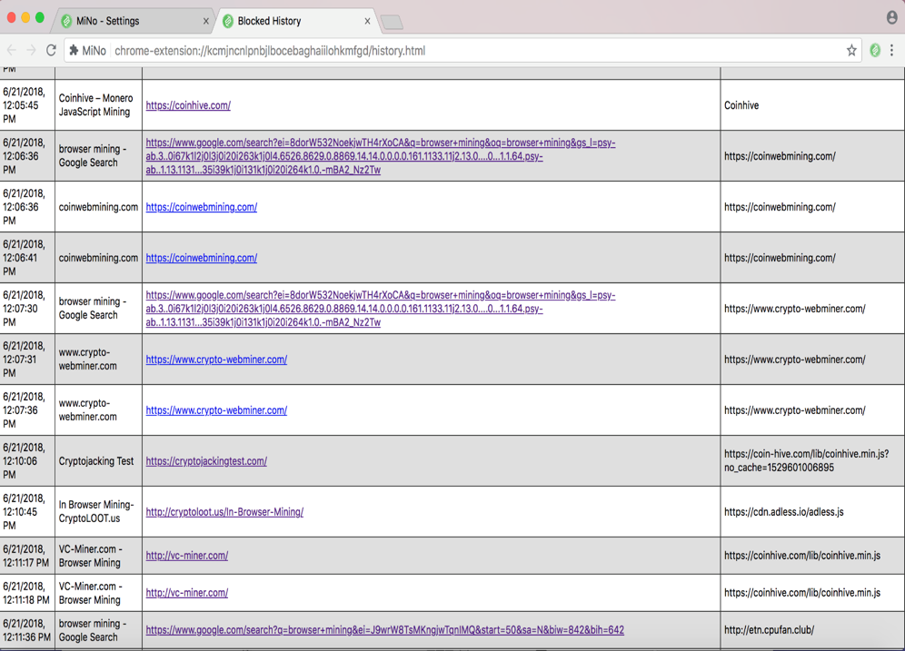
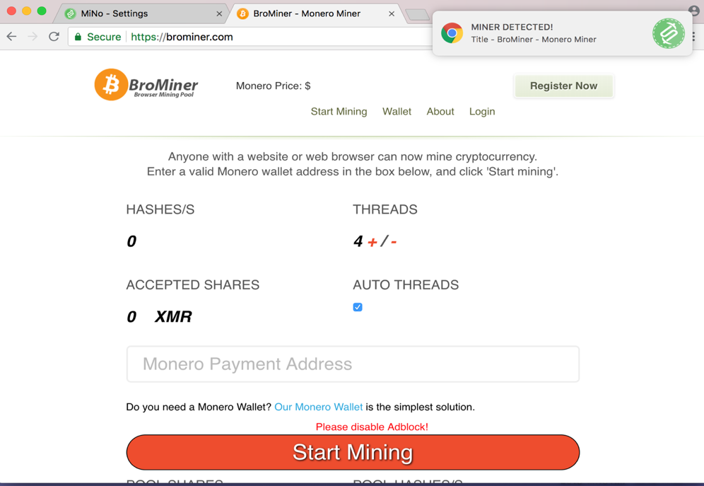
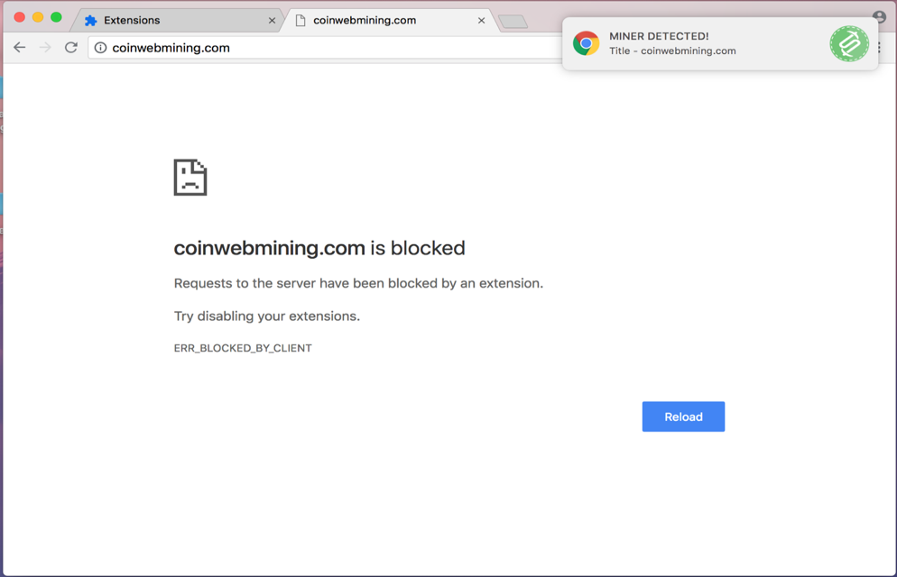

> ##MiNo (Mine No)##

>We named the extension as MiNo with the shortcut of words "Mine" and
>"No". According to the many marketing researches; simple, short and easy
>to remember names more likely to be remembered by user and preferred
>over the long named competitors. In this case, we believe MiNo
>will get ahead with short, phonetic and sympathetic name against
>competitors such as NoCoin, NoMiner, CoinBlock etc.
>
>
>

> ***4.1 Requirements and Installation***
>
> The add-on MiNo was developed and configured for Google Chrome
> Developer Channel which is the newest version of Google Chrome web
> browser. The reason for choosing the developer channel instead of the
> stable channel is, currently CPU-usage control information can be
> reached only in the developer channel and this is one of the main
> function of MiNo to detect and block the malicious processes using
> high percentage of CPU usage. However, these features provided in the
> developer channel are expected to be available in the stable channel
> in near future with the updates and newer versions of Chrome web
> browser's stable channel.
>
> MiNo has not been published to Chrome's extension market yet so it
> needs to be manually installed. Users need to go to the Extensions
> page on Chrome and activate the developer mode. Then the folder
> contains source code files of MiNo can be dragged and dropped to the
> Chrome browser to complete the installation. Once these steps
> completed, icon will appear on the top right side of the browser and
> MiNo will be ready to use.
>
> 

> ***4.2 Overview and Features***
>
> MiNo's icon will appear on the right top part of the Chrome web
> browser within the installation. This is the default location of
> Chrome web browser for extensions. When the MiNo\'s icon is clicked,
> the starting page of MiNo will open on a popup page. Main controls of
> the MiNo located in this popup page including enable/disable control,
> settings where user can change the controls and history where
> information and records of the detected or blocked incidents kept.
> User can enable or disable the program anytime with clicking the icon
> and use the enable/disable button on the popup page. This function is
> useful when the user will voluntarily visit websites has cryptominer
> or any page use higher CPU rate with the user's consent. MiNo can be
> enabled back anytime user wishes without closing or reopening the
> browser since Enable/Disable function works instantly.
>
> 

> ***4.2.1 Settings***
>
> MiNo provides flexible controls for users to personalize the controls
> for their preferences to have better functionality. When the icon
> clicked on the browser, popup page will open and at the bottom of the
> popup page "Settings" button is displayed which allow users to reach
> the controls page to check or change the controls. When the user
> clicks the button, it takes user to a new page displaying the options
> on a new tab on browser.
>
> 
>
> There are four main controls provided under settings. Controls listed
> with a checkbox on the left side allowing user to enable or disable
> the function by clicking the checkbox. Details, functions and working
> principals of the MiNo on the background will be reviewed with details
> in the next chapter. We will review the basic functionality of these
> controls in this section.
>
> First control is "Block cryptominer scripts and URLs". This option is
> controlling the function of checking the malicious scripts and URLs
> contain cryptominers from the blacklist. User can use the checkbox to
> either enable or disable this function. If the user disable this
> option then MiNo will not be blocking the website according to
> malicious scripts and URLs instead, it will only be demanding on CPU
> usage control function to protect the system. Details of this
> protection mechanism works in the background will be explained in next
> chapter.
>
> The second option is "Show warning badge layered over the icon".
> Checkbox allows user to enable or disable the option of having a badge
> placement feature on the extension's icon on the top right of the
> browser whenever a threat detected, which is one of the visual warning
> systems of the program.

> The third option is "Show notification and history of cryptominers".
> This checkbox allows user to enable or disable the notifications
> displayed whenever a threat detected or blocked which is the second
> visual warning system. This option also allows user to log the history
> of the threats detected or blocked in the history section which we
> will review in the next chapter.
>
> 
>
>
> The last option is "Block CPU-hungry processes". This checkbox allows
> user to enable or disable the function of checking and blocking the
> processes using high CPU rate. This is the second layer of protection
> of the MiNo and the main feature separating MiNo from the competitors
> in the market. When MiNo is enabled, it is continuously communicating
> with the task manager of the Chrome web browser to check the CPU usage
> rate of the running processes and blocking the processes using higher
> than the default or user preferred value set. There is a default
> percentage rate set in the function for the CPU usage in the system
> which is 80 however, the dropdown menu located under this last
> checkbox allows user to change this value of CPU usage to be blocked.
> Details and deep analysis of the mechanism will be reviewed in the
> next chapter.
>
> There is also another tab on the Settings page calls "About". This
> page provides information including the version of the program,
> contact information of the developer and credits.
>
> 
>

> ***4.2.2 History***
>
> MiNo is keeping the records of the detected threats with various
> information. The page this information displayed can be reached from
> the "History" button on the main popup page of the program. When user
> clicks the button, a new page on a new tab will be opened to display
> the records. There are four different information is being recorded
> and displayed in this page such as "Date and Time", "Page Title",
> "Page URL" and "Bad Script/Process". Date and time shows exact date
> and time of the detection and all records ordered by this information
> chronologically. Date is displayed in MM/DD/YYYY format and time is
> displayed in HR:MN:SC AM/PM format. Page title provides the title and
> Page URL provides the complete URL of the website where malicious
> event detected. Last column calls Bad Script/Process provides the
> information of the detected malicious script, URL or process. Records
> will be held until it is cleared manually by the user. There is "Clear
> History" button located on the top right of the history page. User can
> click this button to clear the current records. History page can be
> reached easily by clicking the MiNo icon and clicking the history
> button anytime on the browser.
>
> 
>
>
> We reviewed the general details of the user interface and features of
> the MiNo including installation, design, functions and user controls.
> In the next chapter, we will review the details of the security
> mechanism of the MiNo running on background.

> ***4.3 Detection Mechanism (Background)***
>
> MiNo consists of two main mechanisms to detect the malicious processes
> and protect the system resources from being used without the user's
> consent. First mechanism is scanning the website user visiting to
> check the malicious scripts and URLs from the blacklist. Second
> mechanism is checking the CPU usage rate of each process running on
> browser from the task manager to detect any malicious activity.

> ***4.3.1 Blocking Malicious Scripts and URLs***
>
> MiNo collects the malicious cryptominer scripts and URLs from an
> external file calls filters.txt inside the assets folder when it is
> installed into the Chrome browser. These filters in the file have been
> acquired from various resources including previous works and online
> resources. Once the MiNo have collected the filters, it can access to
> the resources and requests of the web page before opening the web page
> using a special function "chrome.webRequest.onBeforeRequest" provided
> by the Chrome API. This function allows MiNo to have enough time to
> check the content before a web request is made by Chrome. Thereupon,
> MiNo scans the resources of the web page to check if there is any
> malicious script or URL. There are three possible results at this
> point. If there is no malicious script or URL found, then web page
> will be loaded regularly without any change or block by MiNo. If MiNo
> detects only malicious script or scripts in the content, it would
> continue to serve the web page to the user however, it will prevent
> the malicious script from being included in the web request. Since the
> script is not included in the web request, it cannot run on the
> background. In this case, MiNo will only block the malicious content
> and let the user to access the web page without any threat to computer
> resources.
>
> 
>
>
> On the other hand, if MiNo detects any malicious URL, it will block
> the whole web page and will not let user to access to the web page in
> order to protect the system resources. While this process is running,
> user is being informed by the notification and badge on the icon
> depending on user preferences on settings. Also, as we mention in the
> previous chapter, this control mechanism can be disabled from settings
> without disabling the program itself.
>
> 

> ***4.3.2 Blocking Processes Using High CPU***
>
> Second mechanism is based on controlling the CPU usage rate of the
> processes running on the Chrome web browser. MiNo controls the CPU
> usage of the processes and blocks the malicious processes using higher
> CPU rate than the set value. Hence, this is the biggest and most
> important difference of MiNo from its competitors. All the competitors
> in the market provide only script and/or URL scanning and consist of
> single layer of protection while MiNo has two different mechanisms
> work together to back up each other for a better protection. We will
> review the details and functions providing the CPU usage control and
> blocking mechanism below.
>
> There is a separate process created in the background for each content
> working on Chrome such as web pages and add-on applications and
> various information including name, CPU usage, network usage etc. of
> these processes can be accessed by task manager and Chrome API.
> Currently this API support is only available on the Chrome Developer
> Channel and this is the main reason for us to choose Chrome Developer
> Channel for MiNo.
>
> MiNo uses Chrome Process API actively on this mechanism. Since there
> are many systems run in internet today with different kinds of CPUs
> and these CPUs have different number of cores. Chrome processes can
> use all the CPU cores, and each core usage is represented as a
> percentage of the CPU usage. In other words, CPU usage can be between
> 0-800 range in a system with 8-core CPU while it can be 0-200 range in
> a system with 2-core CPU. In this case, we first designed MiNo to
> determine the number of the cores of CPU through the Chrome API and
> use variable limit of the CPU usage rate accordingly. However, after
> our detailed tests in both "known malicious websites" and "known clean
> websites" this method did not work as efficient as planned. There were
> many false-positive results appeared during the tests. At this point,
> we redesigned the CPU usage control function with a single set value
> regardless of the number of CPU cores. After a careful review of the
> experiment and test results we determined the optimum value for the
> limit is 80%. However, users can still adjust the default value of
> limit of high CPU usage from the settings page. Tests with lower
> values had too many false positives and harmless processes like
> YouTube blocked by MiNo. In fact, even with the current settings, some
> harmless processes using high CPU rate can be blocked by MiNo. In
> order to prevent this, MiNo uses a 10 second continuous control to
> detect harmful processes over the harmless ones.
>
> All processes that are actively running in Chrome are listened on the
> background and the CPU usage is controlled every time the resource
> usage of the processes is updated. If any process momentarily exceeds
> the limit of high CPU usage, MiNo marks this process as suspicious and
> starts to watch it for 10 seconds. MiNo calculates the average of CPU
> usage rate of these 10 second period and if this average value is over
> 80% then this process is marked as harmful and blocked. User will be
> notified with either badge over the icon and/or popup notification
> according to the preferences. MiNo also keeps records of the blocked
> processes in the history page with details.
>
> Another feature of the MiNo in this mechanism is, once a process using
> high CPU is blocked is also recorded in the CPU hungry process list on
> the background, and whenever the same process is created again, it
> will be blocked instantly. One of the greatest feature of MiNo in this
> mechanism is it will control not only the web pages but also add-ons.
> Whenever an extension is installed and run on Chrome by the user,
> there will be a process created for this extension. Since MiNo
> controls all the running processes regardless of the type, in case if
> there is any malicious software exist in the extension will be blocked
> by MiNo due to high CPU usage. However, Google recently filtered and
> removed most of the harmful extensions from the Chrome market hence we
> could test this feature on only one add-on in experiment section for
> now.
